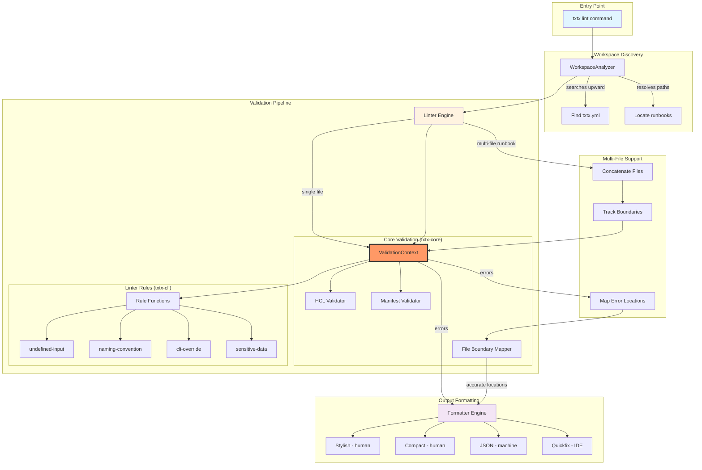
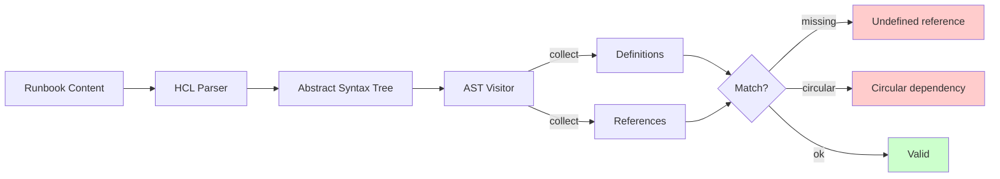
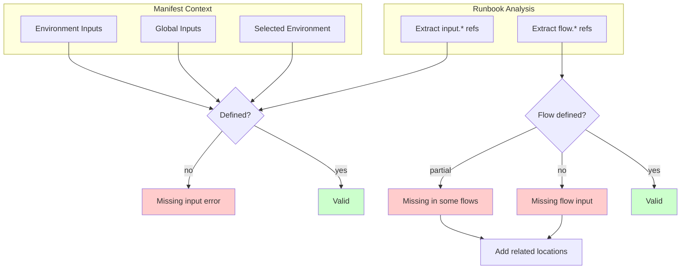
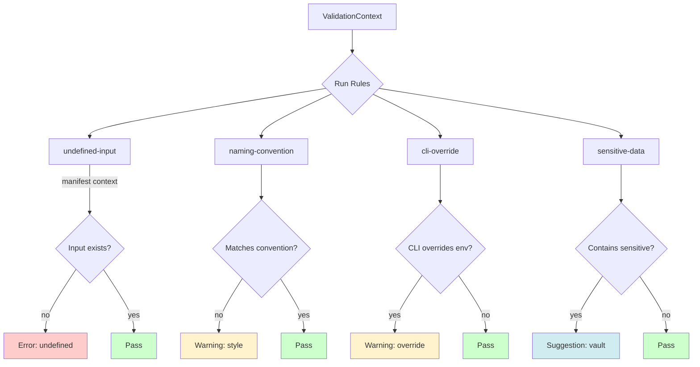
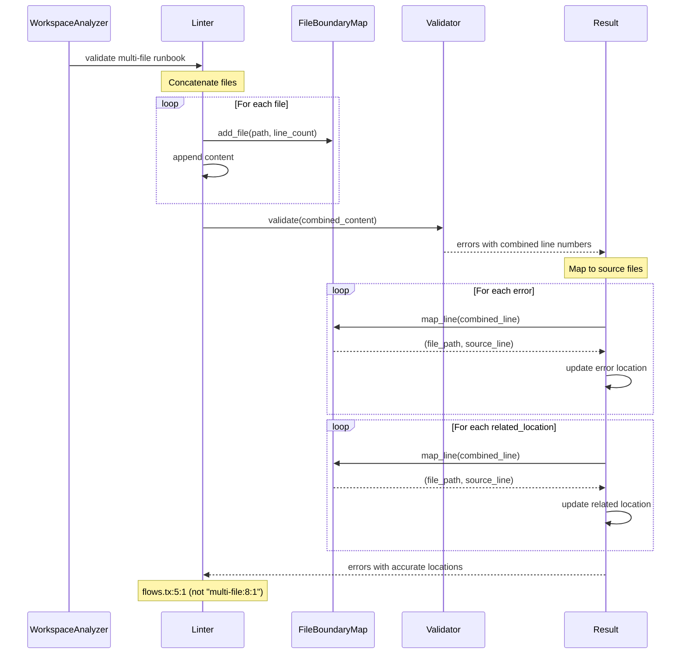
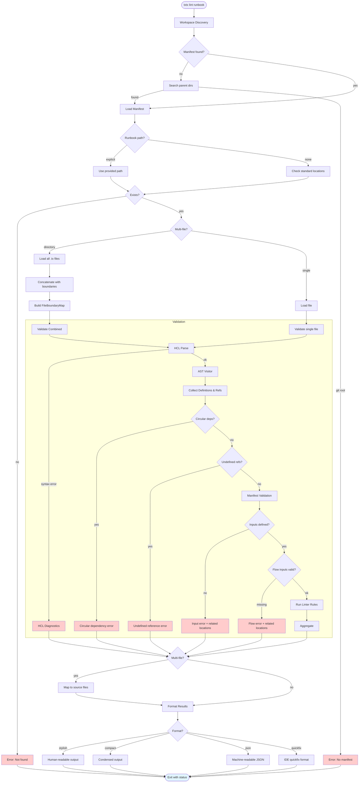

# Linter Architecture

## Overview

The txtx linter performs static analysis of runbooks and manifests, catching configuration errors before execution. It provides pre-execution validation similar to TypeScript's `tsc`, with multiple output formats for both human and machine consumption.

## Architecture Diagram



## Validation Layers

The linter operates in three distinct layers:

### 1. HCL Validation (txtx-core)

**Purpose**: Syntax and semantic correctness



**Checks:**

- Undefined variables, actions, flows
- Circular dependencies
- Invalid syntax
- Type mismatches

### 2. Manifest Validation (txtx-core)

**Purpose**: Environment and input validation



**Checks:**

- Input defined in manifest
- Environment variables exist
- Flow inputs across multi-file runbooks
- Related locations for missing inputs

### 3. Linter Rules (txtx-cli)

**Purpose**: Style, conventions, and best practices



**Rule Types:**

- **Errors**: Must be fixed (undefined inputs)
- **Warnings**: Should be fixed (naming, overrides)
- **Suggestions**: Consider fixing (sensitive data)

## Multi-File Runbook Validation

For runbooks spanning multiple files, the linter uses file boundary mapping to provide accurate error locations:



**Benefits:**

1. **Shared State**: All files in runbook share flow/variable definitions
2. **Accurate Locations**: Errors show correct file:line:col
3. **Related Locations**: Cross-file references shown in context

**Example Output:**

```console
error: Flow 'deploy' missing input 'chain_id' flows.tx:5:1
  → Referenced here
    at deploy.tx:11:5
```

## Module Structure

### Flat Architecture (6 files, ~660 LOC)

```console
cli/linter/
├── mod.rs         # Public API, re-exports (50 lines)
├── config.rs      # LinterConfig struct (40 lines)
├── rules.rs       # All 4 validation rules (165 lines)
├── validator.rs   # Linter engine, IntoManifest trait (160 lines)
├── formatter.rs   # 4 output formats (130 lines)
└── workspace.rs   # Workspace discovery & runbook resolution (115 lines)
```

**Design Principles:**

- Single-level module structure
- Function pointers over trait objects (zero-cost)
- Cow<str> for static strings (zero allocation)
- Data-driven configuration (const arrays)
- Clear separation of concerns

### Performance Characteristics

| Aspect | Implementation | Benefit |
|--------|---------------|---------|
| Rules | `fn(&ValidationContext) -> Option<ValidationIssue>` | Stack allocation, no heap |
| Strings | `Cow::Borrowed("static")` | Zero allocation |
| Patterns | `const SENSITIVE_PATTERNS: &[&str]` | Compile-time data |
| Lifetimes | `ValidationContext<'env, 'content>` | Explicit borrowing |

## Validation Flow

### Complete Validation Pipeline



## Output Formats

The linter supports multiple output formats for different use cases:

### Stylish (Human-readable)

```console
error: Flow 'deploy' missing input 'chain_id' flows.tx:5:1
  → Referenced here
    at deploy.tx:11:5

warning: Input 'api_key' uses CLI override main.tx:8:1
  The CLI input '--input api_key=value' overrides the manifest environment value
```

### Compact (Condensed)

```console
flows.tx:5:1 error Flow 'deploy' missing input 'chain_id'
main.tx:8:1 warning Input 'api_key' uses CLI override
```

### JSON (Machine-readable)

```json
{
  "errors": [
    {
      "message": "Flow 'deploy' missing input 'chain_id'",
      "file": "flows.tx",
      "line": 5,
      "column": 1,
      "related_locations": [
        {"file": "deploy.tx", "line": 11, "column": 5, "message": "Referenced here"}
      ]
    }
  ]
}
```

### Quickfix (IDE integration)

```console
flows.tx:5:1: error: Flow 'deploy' missing input 'chain_id'
deploy.tx:11:5: note: Referenced here
```

## Integration Points

### CLI Integration

```console
txtx lint [RUNBOOK] [OPTIONS]
  --manifest-path PATH    Explicit manifest location
  --env ENV              Environment to validate against
  --input KEY=VALUE      CLI input overrides (triggers warnings)
  --format FORMAT        Output format (stylish|compact|json|quickfix)
  --gen-cli              Generate CLI command from inputs
```

### LSP Integration

The linter is used by the LSP for real-time diagnostics:

```rust
// LSP calls linter for workspace diagnostics
let result = linter.validate_content(
    &combined_content,
    &manifest,
    environment,
    addon_specs,
)?;

// Map errors to source files
result.map_errors_to_source_files(&boundary_map);

// Convert to LSP diagnostics
let diagnostics = result.errors.iter()
    .map(|e| to_lsp_diagnostic(e))
    .collect();
```

## Key Features

1. **Multi-file Validation**: Validates entire runbooks with shared state
2. **File Boundary Mapping**: Accurate error locations across files
3. **Related Locations**: Shows cross-file references in error context
4. **Flow Validation**: Validates flow inputs across runbook files
5. **Environment Context**: Validates against specific manifest environments
6. **Multiple Formats**: Human and machine-readable output
7. **Workspace Discovery**: Automatic manifest location
8. **Zero-cost Abstractions**: Function pointers, no heap allocation

## Related Documentation

- [Validation Architecture](../../developer/VALIDATION_ARCHITECTURE.md) - Deep dive into validation system
- [Linter User Guide](../../user/linter-guide.md) - Usage and examples
- [ADR 003: Capture Everything Pattern](../../adr/003-capture-everything-filter-later-pattern.md) - Validation approach
- [ADR 004: Visitor Strategy Pattern](../../adr/004-visitor-strategy-pattern-with-readonly-iterators.md) - AST traversal
