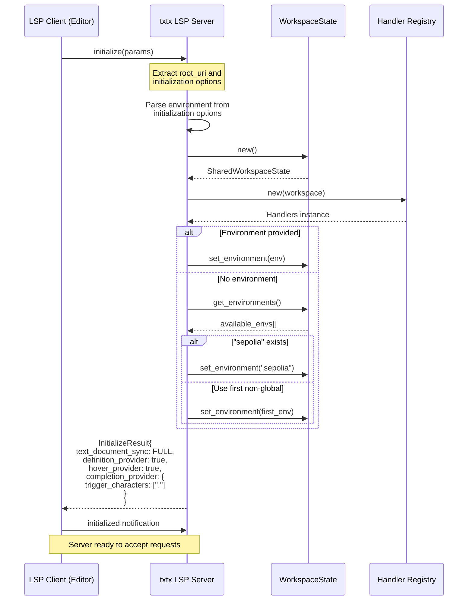
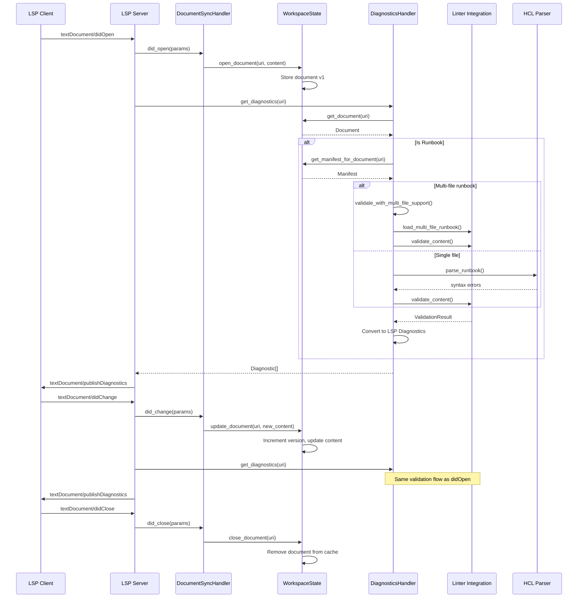
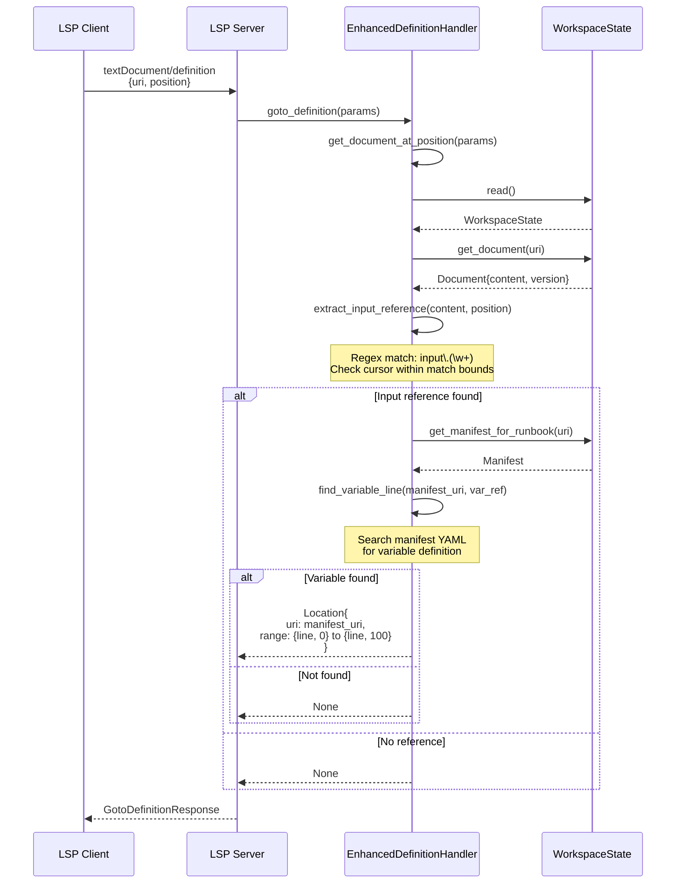
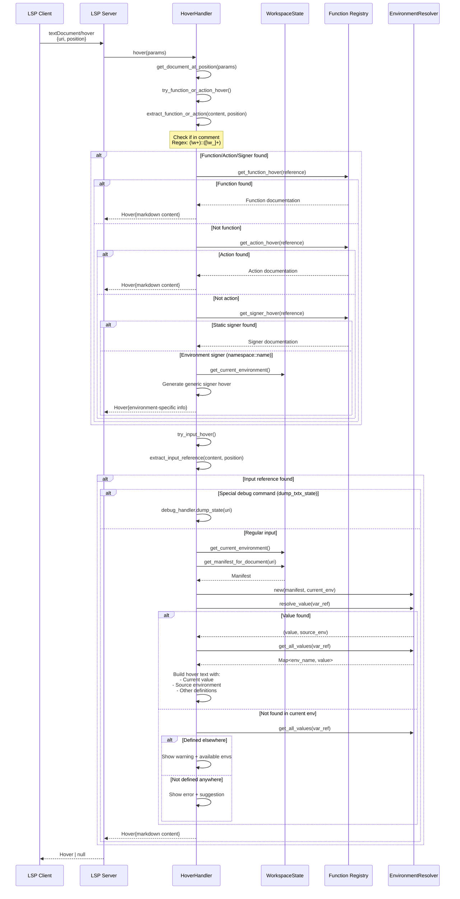
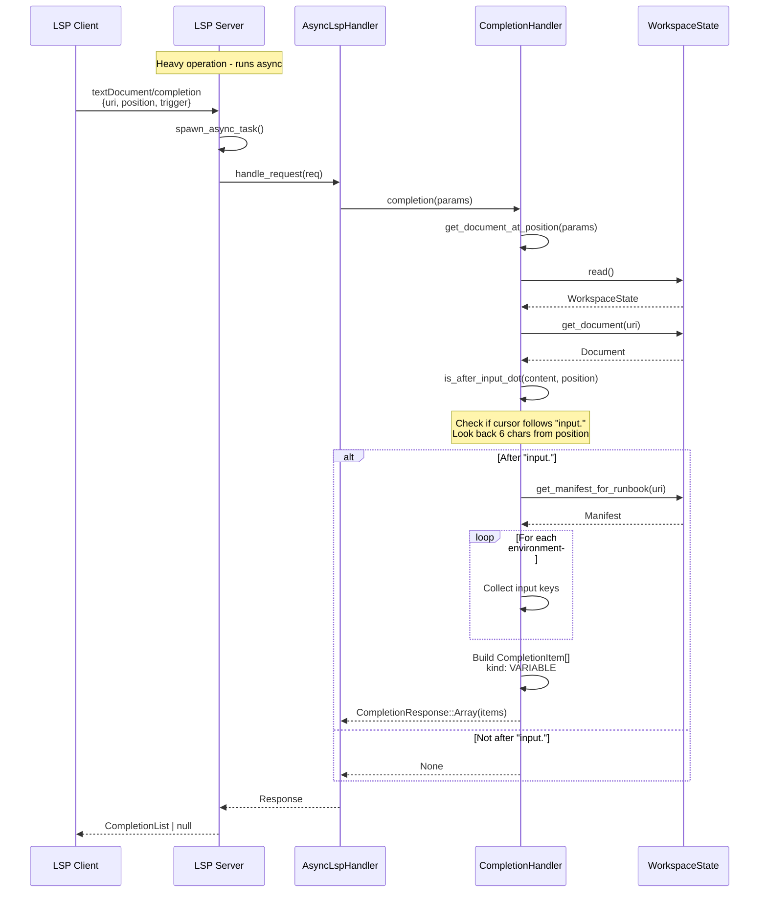
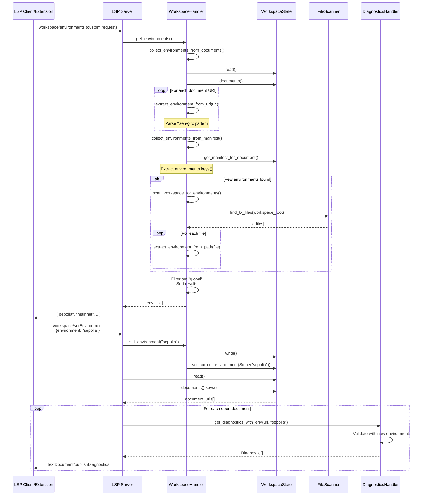
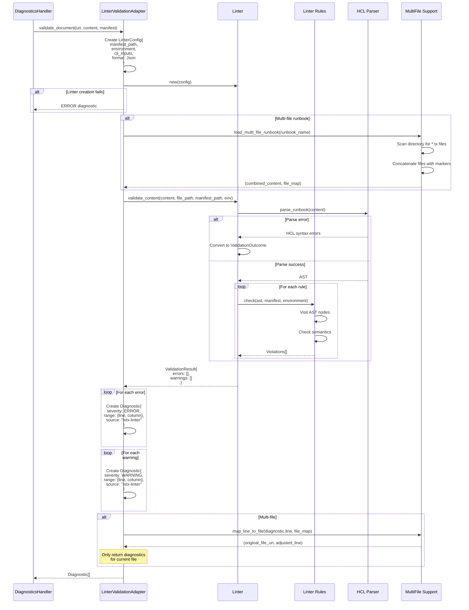

# txtx LSP Sequence Diagrams

This document contains sequence diagrams for all implemented LSP actions in the txtx Language Server.

## 1. Initialize & Server Capabilities

## 2. Document Lifecycle (didOpen/didChange/didClose)

## 3. Go to Definition

## 4. Hover Information

## 5. Code Completion

## 6. Environment Management (Custom)

## 7. Diagnostics with Linter Integration

## Key Components Summary

### Handlers
- **DocumentSyncHandler**: Manages document lifecycle (open/change/close)
- **EnhancedDefinitionHandler**: Go-to-definition for inputs
- **HoverHandler**: Context-aware hover with function/action/input info
- **CompletionHandler**: Auto-completion for inputs after "input."
- **DiagnosticsHandler**: Real-time validation with linter rules
- **WorkspaceHandler**: Environment management (custom protocol)

### Validation Flow
1. **HCL Parser**: Syntax validation
2. **Linter Rules**: Semantic validation (undefined-input, cli-override, etc.)
3. **Multi-file Support**: Handles directory-based runbooks
4. **Environment Context**: Validates against selected environment

### Async Operations
- Completion and hover requests run in Tokio runtime
- Heavy operations don't block main LSP thread
- Results sent back via channel

### State Management
- **SharedWorkspaceState**: Thread-safe `Arc<RwLock<WorkspaceState>>`
- Tracks open documents with versions
- Caches parsed manifests
- Maintains current environment selection
