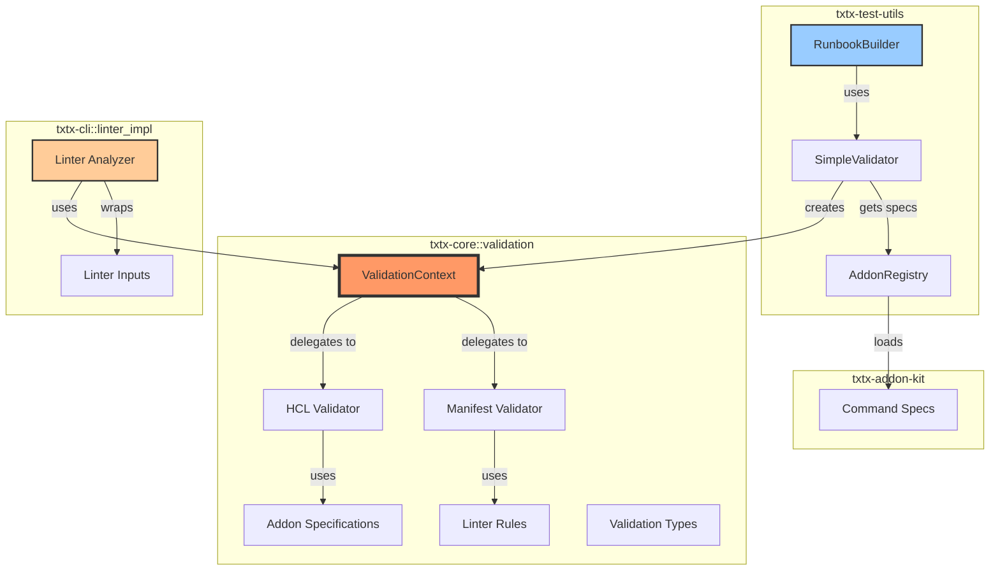
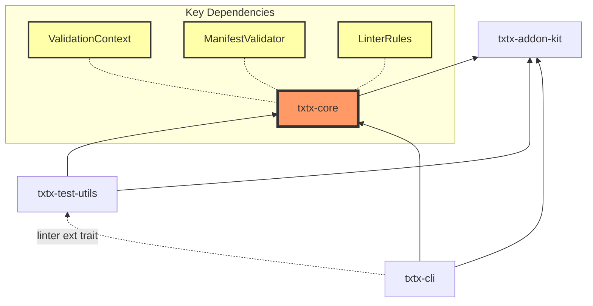
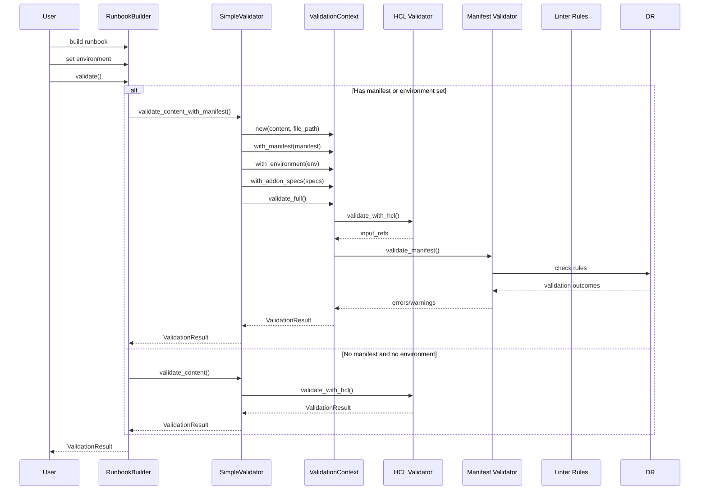
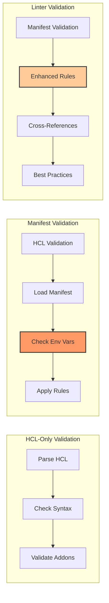
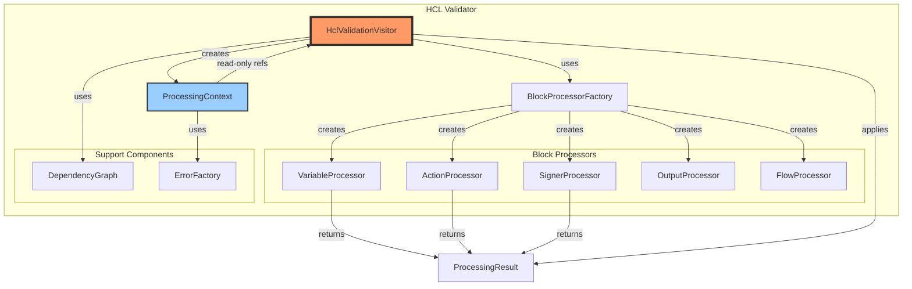
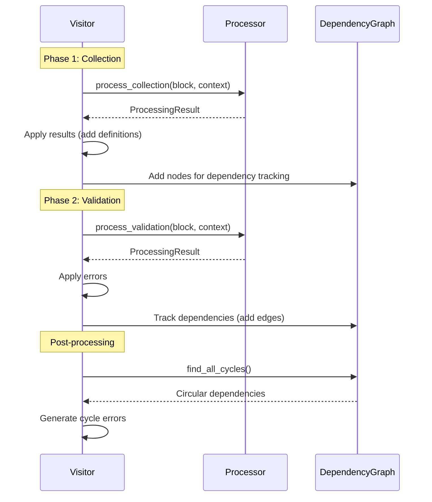

# Validation Architecture

This document describes the validation system architecture in txtx, including the recent refactoring that introduced `ValidationContext` and moved manifest validation from CLI to core.

## Executive Summary

The txtx validation system provides **four layers of validation** using a unified `ValidationContext`:

1. **HCL Syntax** - Validates runbook syntax and structure
2. **Semantic** - Checks references, types, and addon specifications
3. **Manifest** - Validates inputs against workspace manifest environments
4. **Linter** - Enhanced validation with custom rules (undefined-input, cli-override, etc.)

**Key Architecture**: `ValidationContext` (in `txtx-core`) coordinates all validation layers, maintaining state and computing effective inputs from manifest environments + CLI overrides. The `RunbookBuilder` (in `txtx-test-utils`) provides a fluent API for testing. See diagrams below for component relationships and validation flows.

---

## Overview

The txtx validation system provides multiple levels of validation:

1. **HCL Syntax Validation** - Validates the runbook syntax
2. **Semantic Validation** - Checks references, types, and addon specifications
3. **Manifest Validation** - Validates environment variables and inputs against a workspace manifest
4. **Linter Validation** - Enhanced validation with additional rules and checks

## Component Diagram



## Dependency Diagram



## Validation Workflow



## Validation Modes Comparison



## Key Design Decisions

### 1. ValidationContext Introduction

The `ValidationContext` consolidates all validation parameters into a single object:

- Reduces parameter passing complexity
- Enables cleaner extension with new validation features
- Provides caching for computed values (e.g., effective inputs)

### 2. Manifest Validation Requirements

Manifest validation **requires** an environment to be specified:

- Without an environment, only "defaults" can be validated (partial scenario)
- This prevents false confidence from incomplete validation
- RunbookBuilder enforces this by requiring both manifest AND environment

### 3. Separation of Concerns

- **txtx-core**: Core validation logic (HCL, manifest, rules)
- **txtx-cli**: Linter-specific analysis and enhanced validation
- **txtx-test-utils**: Test builder API and validation helpers

### 4. Extensible Rules System

The `ManifestValidationRule` trait allows:

- Core rules in txtx-core
- Linter-specific rules in txtx-core (used by CLI)
- Custom rules for specific use cases

## ValidationContext API

```rust
// Create context with builder pattern
let mut context = ValidationContext::new(content, "test.tx")
    .with_manifest(manifest)
    .with_environment("production")
    .with_cli_inputs(vec![("key", "value")])
    .with_addon_specs(specs);

// Run full validation pipeline
context.validate_full(&mut result)?;

// Or run specific validation phases
context.validate_hcl(&mut result)?;
context.validate_manifest(config, &mut result);
```

## Rule Implementation Example

```rust
pub struct SensitiveDataRule;

impl ManifestValidationRule for SensitiveDataRule {
    fn check(&self, context: &ManifestValidationContext) -> ValidationOutcome {
        const SENSITIVE_MARKERS: &[&str] = &["key", "secret"];
        
        let is_sensitive = SENSITIVE_MARKERS
            .iter()
            .any(|marker| context.input_name.contains(marker));
        
        if !is_sensitive {
            return ValidationOutcome::Pass;
        }
        
        context
            .effective_inputs
            .get(&context.input_name)
            .filter(|value| !value.starts_with('$') && !value.contains("vault"))
            .map(|_| ValidationOutcome::Warning {
                message: format!("Sensitive data in '{}' may be exposed", context.input_name),
                suggestion: Some("Consider using environment variables or a secrets manager".into()),
            })
            .unwrap_or(ValidationOutcome::Pass)
    }
}
```

## HCL Validator Architecture

### Overview

The HCL Validator uses a **Visitor-Strategy Pattern with Read-Only Iterators** to process different block types in runbooks. This architecture was introduced in ADR-004 to address code duplication, state management complexity, and extensibility issues.

### Architecture Components



### Key Design Patterns

#### 1. Read-Only Iterator Pattern

Processors receive read-only references to the visitor's state through `ProcessingContext`:

```rust
pub struct ProcessingContext<'a> {
    // Read-only references to visitor's state
    pub defined_variables: &'a HashSet<String>,
    pub defined_signers: &'a HashMap<String, String>,
    pub addon_specs: &'a HashMap<String, Vec<CommandSpec>>,
    // Error reporting utilities
    pub file_path: &'a str,
    pub source: &'a str,
}
```

#### 2. Result-Based Processing

Processors return results instead of mutating state:

```rust
pub struct ProcessingResult {
    pub variables: Vec<String>,
    pub signers: Vec<(String, String)>,
    pub errors: Vec<ValidationError>,
    pub current_block_name: Option<String>,
}
```

#### 3. Two-Phase Validation

The validator runs two passes over the HCL:



### Benefits of This Architecture

1. **Clear Ownership**: The visitor maintains exclusive ownership of all state
2. **No Shared Mutable State**: Eliminates complex borrowing patterns and race conditions
3. **Extensibility**: New block types only require implementing the `BlockProcessor` trait
4. **Testability**: Processors are essentially pure functions with clear inputs/outputs
5. **Maintainability**: Each processor is self-contained with single responsibility
6. **Performance**: No unnecessary cloning - only read-only references passed around

### Example: Adding a New Block Type

To add support for a new block type (e.g., `webhook`):

```rust
// 1. Create the processor
pub struct WebhookProcessor;

impl BlockProcessor for WebhookProcessor {
    fn process_collection(&mut self, block: &Block, context: &ProcessingContext)
        -> ProcessingResult {
        // Extract webhook definition
    }

    fn process_validation(&mut self, block: &Block, context: &ProcessingContext)
        -> ProcessingResult {
        // Validate webhook configuration
    }
}

// 2. Register in factory
impl BlockProcessorFactory {
    pub fn create(block_type: &str) -> Option<Box<dyn BlockProcessor>> {
        match block_type {
            // ... existing types ...
            "webhook" => Some(Box::new(WebhookProcessor)),
            _ => None,
        }
    }
}
```

## Future Enhancements

1. **Async Validation** - Support for async validation rules
2. **Parallel Rule Execution** - Run independent rules concurrently
3. **Rule Priorities** - Allow rules to specify execution order
4. **Validation Caching** - Cache validation results for unchanged content
5. **Custom Rule Plugins** - Dynamic loading of validation rules
6. **Incremental Validation** - Only revalidate changed portions of runbooks
