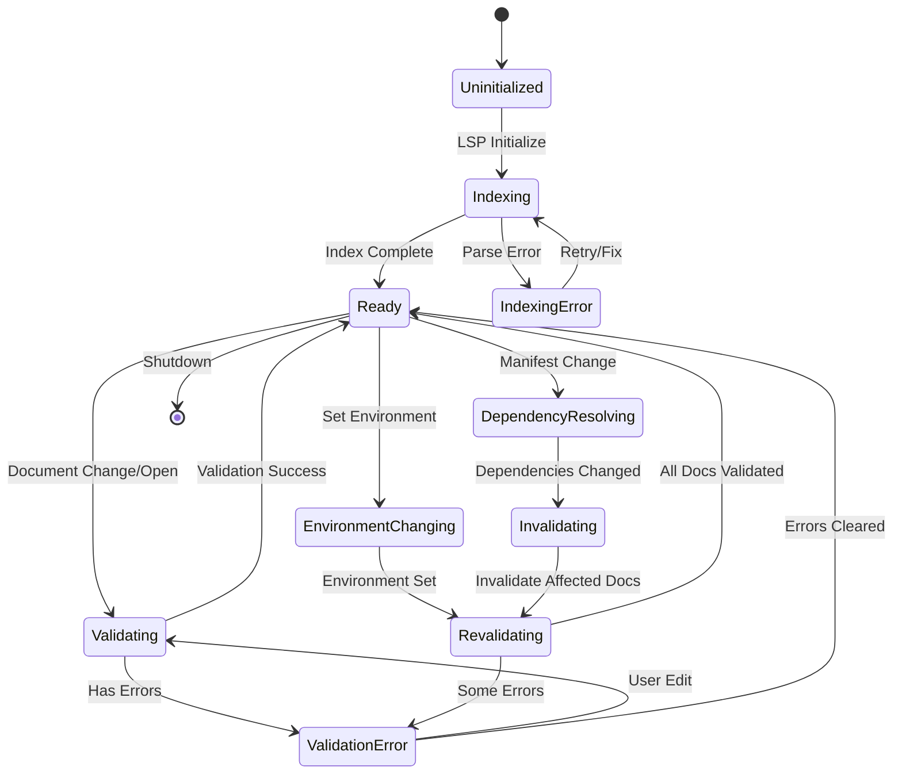
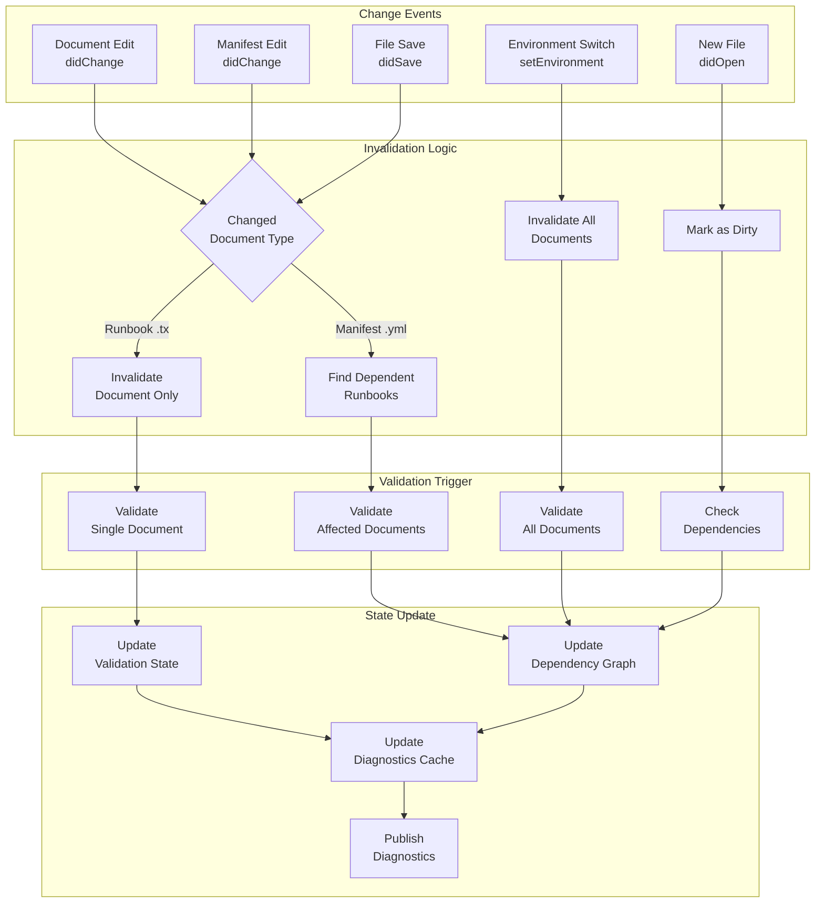
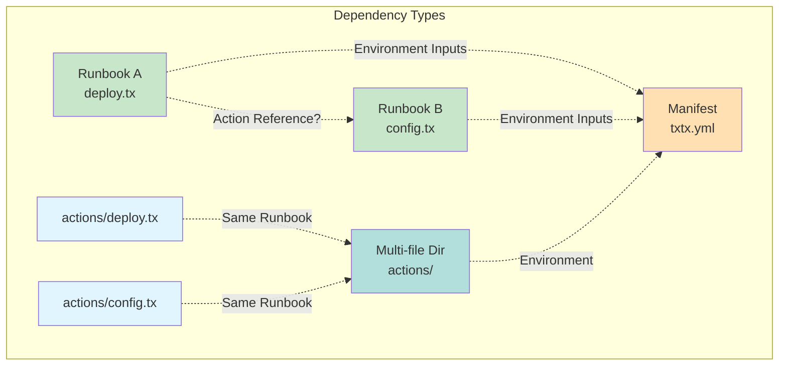
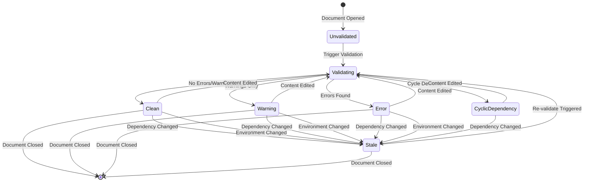
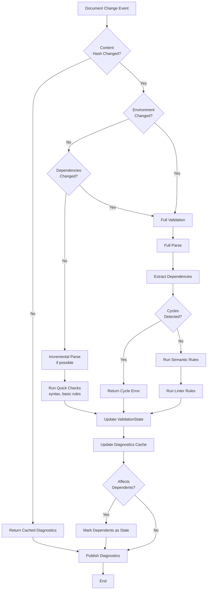

# LSP State Management Architecture

## 🎯 Implementation Status

**Phases Complete**: 5 / 7 (Phase 6 complete, Phase 5 deferred)
**Current Status**: State machine infrastructure complete with observability
**Test Coverage**: 144 tests passing (100% success rate, +29 new state machine tests)
**Code Quality**: Zero DRY violations, idiomatic Rust throughout

### Completed Phases

✅ **Phase 1: Foundation** - Validation state, dependency graph, content hashing
✅ **Phase 2: Dependency Tracking** - Automatic extraction, cross-file resolution
✅ **Phase 3: Smart Invalidation** - Cascade validation, transitive dependencies
✅ **Phase 4: Integration** - LSP handler integration, environment switching
✅ **Phase 6: State Machine** - Workspace-level state tracking with observability and audit trail

### Next Phase

🔜 **Phase 5: Performance & Polish** - Validation debouncing, metrics, optimization
   - Can now leverage Phase 6 state tracking for performance metrics
   - Debounce rapid edits (300ms threshold)
   - Track time-in-state and transition counts

### Key Achievements

- **Automatic Cascade Validation**: Changes propagate to all dependent files
- **Smart Environment Switching**: Re-validates all documents with new context
- **Transitive Dependencies**: Correctly handles A→B→C dependency chains
- **Content Hashing**: Prevents redundant validation of unchanged documents
- **Zero Overhead**: Only affected documents are re-validated

---

## Original State Analysis (Pre-Implementation)

### Existing State Structure

The current LSP maintains state in `WorkspaceState`:

```rust
pub struct WorkspaceState {
    documents: HashMap<Url, Document>,           // Open documents with versions
    manifests: HashMap<Url, Manifest>,           // Parsed manifests
    runbook_to_manifest: HashMap<Url, Url>,      // Runbook -> Manifest mapping
    environment_vars: HashMap<String, HashMap<String, String>>, // Cached env vars
    current_environment: Option<String>,         // Selected environment
}
```

### Original Issues (All Resolved ✅)

1. ~~**No Dependency Tracking**~~ → **RESOLVED**: Automatic dependency extraction and tracking (Phase 2)
2. ~~**No Validation State Cache**~~ → **RESOLVED**: Content hashing + validation cache (Phase 1)
3. ~~**No Change Propagation**~~ → **RESOLVED**: Cascade validation through dependency graph (Phase 3)
4. ~~**No Incremental Updates**~~ → **RESOLVED**: Only affected documents re-validated (Phase 4)
5. ~~**No Cycle Detection State**~~ → **RESOLVED**: Persistent cycle detection with caching (Phase 1)
6. ~~**Race Conditions**~~ → **RESOLVED**: Proper locking and state synchronization (Phases 1-4)

---

## Proposed State Management Architecture

### 1. State Machine Design



### 2. Enhanced State Structure

```rust
/// Enhanced workspace state with dependency tracking and caching
pub struct EnhancedWorkspaceState {
    // Core state (existing)
    documents: HashMap<Url, Document>,
    manifests: HashMap<Url, Manifest>,
    runbook_to_manifest: HashMap<Url, Url>,
    current_environment: Option<String>,

    // NEW: Validation cache
    validation_cache: HashMap<Url, ValidationState>,

    // NEW: Dependency graph
    dependencies: DependencyGraph,

    // NEW: Change tracking
    dirty_documents: HashSet<Url>,

    // NEW: State machine
    machine_state: MachineState,

    // NEW: Last validation results
    diagnostics_cache: HashMap<Url, (Vec<Diagnostic>, u64)>, // (diagnostics, timestamp)
}

/// Per-document validation state
#[derive(Debug, Clone)]
pub struct ValidationState {
    /// Current status
    pub status: ValidationStatus,
    /// Last validation timestamp
    pub last_validated: SystemTime,
    /// Content hash when last validated
    pub content_hash: u64,
    /// Environment used for validation
    pub validated_environment: Option<String>,
    /// Cached diagnostics
    pub diagnostics: Vec<Diagnostic>,
    /// Dependencies that affect this document
    pub dependencies: HashSet<Url>,
}

#[derive(Debug, Clone, PartialEq)]
pub enum ValidationStatus {
    /// Never validated
    Unvalidated,
    /// Currently validating
    Validating,
    /// Validated with no errors
    Clean,
    /// Validated with warnings only
    Warning,
    /// Validated with errors
    Error,
    /// Needs re-validation (dependency changed)
    Stale,
    /// Cycle detected
    CyclicDependency,
}

#[derive(Debug, Clone, PartialEq)]
pub enum MachineState {
    Uninitialized,
    Indexing,
    IndexingError,
    Ready,
    Validating { document: Url },
    EnvironmentChanging { new_env: String },
    Revalidating { documents: Vec<Url>, current: usize },
    DependencyResolving,
    Invalidating { affected: HashSet<Url> },
}

/// Dependency graph for tracking file relationships
#[derive(Debug, Clone)]
pub struct DependencyGraph {
    /// Forward edges: document -> documents it depends on
    depends_on: HashMap<Url, HashSet<Url>>,
    /// Reverse edges: document -> documents that depend on it
    dependents: HashMap<Url, HashSet<Url>>,
    /// Cycle detection cache
    has_cycle: Option<bool>,
    cycle_nodes: Vec<Url>,
}
```

### 3. State Invalidation Strategy



### 4. Change Detection & Propagation

#### Scenario 1: User Edits Runbook (Fix Cycle Dependency)

```mermaid
sequenceDiagram
    participant User
    participant Editor
    participant LSP
    participant State as WorkspaceState
    participant Validator
    participant DepGraph as DependencyGraph

    Note over State: Current: ValidationStatus::CyclicDependency

    User->>Editor: Edit runbook to fix cycle
    Editor->>LSP: textDocument/didChange
    LSP->>State: update_document(uri, new_content)
    State->>State: Compute content_hash(new_content)

    alt Hash changed
        State->>State: Mark validation as Stale
        State->>State: Add to dirty_documents

        LSP->>Validator: validate_document(uri, content)
        Validator->>Validator: Parse & check syntax

        alt Parse success
            Validator->>DepGraph: extract_dependencies(ast)
            DepGraph->>DepGraph: detect_cycles()

            alt No cycle
                DepGraph-->>Validator: Clean graph
                Validator->>Validator: Run semantic rules
                Validator-->>LSP: ValidationResult::Clean

                LSP->>State: Update ValidationState {
                Note over State: status: Clean<br/>content_hash: new_hash<br/>validated_environment: current_env<br/>diagnostics: []
                }

                LSP->>Editor: publishDiagnostics([])
                Note over Editor: Clear error markers

            else Cycle still exists
                DepGraph-->>Validator: Cycle: [A -> B -> C -> A]
                Validator-->>LSP: ValidationResult::CyclicDependency

                LSP->>State: Update ValidationState {
                Note over State: status: CyclicDependency<br/>diagnostics: [cycle error]
                }

                LSP->>Editor: publishDiagnostics([cycle error])
                Note over Editor: Show cycle error
            end

        else Parse error
            Validator-->>LSP: ValidationResult::SyntaxError
            LSP->>State: Update ValidationState {
            Note over State: status: Error<br/>diagnostics: [syntax errors]
            }
            LSP->>Editor: publishDiagnostics([syntax errors])
        end

    else Hash unchanged
        Note over State: Skip validation - no actual change
        LSP->>Editor: publishDiagnostics(cached)
    end
```

#### Scenario 2: User Edits Manifest (Changes Environment Inputs)

```mermaid
sequenceDiagram
    participant User
    participant Editor
    participant LSP
    participant State as WorkspaceState
    participant DepGraph as DependencyGraph
    participant Validator

    Note over State: 3 runbooks open<br/>Environment: sepolia

    User->>Editor: Add new input to manifest<br/>environments.sepolia.new_api_key
    Editor->>LSP: textDocument/didChange (txtx.yml)

    LSP->>State: update_document(manifest_uri, new_content)
    State->>State: Re-parse manifest
    State->>State: Update environment_vars cache

    LSP->>DepGraph: get_dependents(manifest_uri)
    DepGraph-->>LSP: [runbook_a.tx, runbook_b.tx, runbook_c.tx]

    loop For each dependent runbook
        LSP->>State: Mark ValidationState as Stale
        LSP->>State: Add to dirty_documents
    end

    LSP->>State: Set machine_state = Revalidating {
    Note over State: documents: [a, b, c]<br/>current: 0
    }

    par Validate all affected runbooks
        LSP->>Validator: validate(runbook_a)
        and
        LSP->>Validator: validate(runbook_b)
        and
        LSP->>Validator: validate(runbook_c)
    end

    loop For each validation result
        Validator-->>LSP: ValidationResult
        LSP->>State: Update ValidationState
        LSP->>Editor: publishDiagnostics
    end

    LSP->>State: Set machine_state = Ready
    LSP->>State: Clear dirty_documents
```

#### Scenario 3: User Switches Environment

```mermaid
sequenceDiagram
    participant User
    participant VSCode as VS Code Extension
    participant LSP
    participant State as WorkspaceState
    participant Validator

    Note over State: Current env: sepolia<br/>5 documents open

    User->>VSCode: Select "mainnet" from dropdown
    VSCode->>LSP: workspace/setEnvironment {env: "mainnet"}

    LSP->>State: Set machine_state = EnvironmentChanging
    LSP->>State: set_current_environment(Some("mainnet"))

    LSP->>State: Get all open documents
    State-->>LSP: [doc1, doc2, doc3, doc4, doc5]

    loop For each document
        LSP->>State: Check if runbook
        alt Is runbook
            LSP->>State: Check ValidationState.validated_environment
            alt Environment changed
                LSP->>State: Set status = Stale
                LSP->>State: Add to dirty_documents
            end
        end
    end

    LSP->>State: Set machine_state = Revalidating

    par Validate all dirty docs
        loop For each dirty document
            LSP->>Validator: validate_with_env(uri, "mainnet")
            Validator->>Validator: Check inputs against mainnet env
            Validator-->>LSP: ValidationResult

            LSP->>State: Update ValidationState {
            Note over State: validated_environment: "mainnet"<br/>status: Clean/Warning/Error<br/>diagnostics: [...]
            }

            LSP->>VSCode: publishDiagnostics(uri, diagnostics)
        end
    end

    LSP->>State: Set machine_state = Ready
    LSP->>State: Clear dirty_documents

    Note over VSCode: All documents show<br/>mainnet-specific errors
```

### 5. Dependency Graph Management

#### Building the Graph

```rust
impl DependencyGraph {
    /// Add a dependency relationship
    pub fn add_dependency(&mut self, dependent: Url, depends_on: Url) {
        self.depends_on
            .entry(dependent.clone())
            .or_insert_with(HashSet::new)
            .insert(depends_on.clone());

        self.dependents
            .entry(depends_on)
            .or_insert_with(HashSet::new)
            .insert(dependent);

        // Invalidate cycle cache
        self.has_cycle = None;
    }

    /// Detect cycles using DFS
    pub fn detect_cycles(&mut self) -> Option<Vec<Url>> {
        if let Some(has_cycle) = self.has_cycle {
            return if has_cycle { Some(self.cycle_nodes.clone()) } else { None };
        }

        let mut visited = HashSet::new();
        let mut rec_stack = HashSet::new();
        let mut path = Vec::new();

        for node in self.depends_on.keys() {
            if self.dfs_cycle(node, &mut visited, &mut rec_stack, &mut path) {
                self.has_cycle = Some(true);
                self.cycle_nodes = path;
                return Some(path);
            }
        }

        self.has_cycle = Some(false);
        None
    }

    /// Get all documents affected by a change to `uri`
    pub fn get_affected_documents(&self, uri: &Url) -> HashSet<Url> {
        let mut affected = HashSet::new();
        self.collect_dependents(uri, &mut affected);
        affected
    }

    /// Recursively collect all dependents
    fn collect_dependents(&self, uri: &Url, affected: &mut HashSet<Url>) {
        if let Some(deps) = self.dependents.get(uri) {
            for dep in deps {
                if affected.insert(dep.clone()) {
                    self.collect_dependents(dep, affected);
                }
            }
        }
    }
}
```

#### Dependency Types



**Dependency Rules:**
1. **Runbook → Manifest**: All runbooks depend on their manifest for environment inputs
2. **Multi-file Parts → Directory**: All `.tx` files in multi-file runbook depend on directory
3. **Action References** (future): Runbook A → Runbook B if A calls actions from B

### 6. Validation State Transitions



### 7. Optimized Validation Flow



### 8. Content Hashing for Change Detection

```rust
use std::hash::{Hash, Hasher};
use std::collections::hash_map::DefaultHasher;

impl WorkspaceState {
    /// Compute hash of document content
    fn compute_content_hash(content: &str) -> u64 {
        let mut hasher = DefaultHasher::new();
        content.hash(&mut hasher);
        hasher.finish()
    }

    /// Check if document needs re-validation
    pub fn needs_validation(&self, uri: &Url, content: &str) -> bool {
        if let Some(validation_state) = self.validation_cache.get(uri) {
            let current_hash = Self::compute_content_hash(content);

            // Need validation if:
            // 1. Content hash changed
            if current_hash != validation_state.content_hash {
                return true;
            }

            // 2. Environment changed
            if validation_state.validated_environment != self.current_environment {
                return true;
            }

            // 3. Status is Stale (dependency changed)
            if validation_state.status == ValidationStatus::Stale {
                return true;
            }

            // 4. Never validated or validating
            if matches!(validation_state.status,
                       ValidationStatus::Unvalidated | ValidationStatus::Validating) {
                return true;
            }

            false
        } else {
            // No validation state = needs validation
            true
        }
    }
}
```

### 9. Event-Driven State Updates

```rust
/// Events that trigger state changes
#[derive(Debug, Clone)]
pub enum StateEvent {
    DocumentOpened { uri: Url, content: String },
    DocumentChanged { uri: Url, content: String },
    DocumentClosed { uri: Url },
    EnvironmentChanged { new_env: String },
    ValidationCompleted { uri: Url, result: ValidationResult },
    DependencyChanged { uri: Url, affected: HashSet<Url> },
}

impl EnhancedWorkspaceState {
    /// Process an event and update state accordingly
    pub fn process_event(&mut self, event: StateEvent) -> Vec<StateAction> {
        match event {
            StateEvent::DocumentOpened { uri, content } => {
                self.handle_document_opened(uri, content)
            }
            StateEvent::DocumentChanged { uri, content } => {
                self.handle_document_changed(uri, content)
            }
            StateEvent::DocumentClosed { uri } => {
                self.handle_document_closed(uri)
            }
            StateEvent::EnvironmentChanged { new_env } => {
                self.handle_environment_changed(new_env)
            }
            StateEvent::ValidationCompleted { uri, result } => {
                self.handle_validation_completed(uri, result)
            }
            StateEvent::DependencyChanged { uri, affected } => {
                self.handle_dependency_changed(uri, affected)
            }
        }
    }

    fn handle_document_changed(&mut self, uri: Url, content: String) -> Vec<StateAction> {
        let mut actions = Vec::new();

        // Update document
        if let Some(doc) = self.documents.get_mut(&uri) {
            doc.update(content.clone());
        }

        // Check if validation needed
        if self.needs_validation(&uri, &content) {
            // Mark as dirty
            self.dirty_documents.insert(uri.clone());

            // Trigger validation
            actions.push(StateAction::ValidateDocument { uri: uri.clone() });

            // If it's a manifest, mark dependents as stale
            if self.is_manifest(&uri) {
                if let Some(affected) = self.dependencies.get_dependents(&uri) {
                    for dep_uri in affected {
                        if let Some(val_state) = self.validation_cache.get_mut(&dep_uri) {
                            val_state.status = ValidationStatus::Stale;
                            self.dirty_documents.insert(dep_uri.clone());
                            actions.push(StateAction::ValidateDocument { uri: dep_uri });
                        }
                    }
                }
            }
        } else {
            // Content unchanged - use cached diagnostics
            if let Some(val_state) = self.validation_cache.get(&uri) {
                actions.push(StateAction::PublishDiagnostics {
                    uri,
                    diagnostics: val_state.diagnostics.clone(),
                });
            }
        }

        actions
    }
}

/// Actions to be performed after state update
#[derive(Debug, Clone)]
pub enum StateAction {
    ValidateDocument { uri: Url },
    PublishDiagnostics { uri: Url, diagnostics: Vec<Diagnostic> },
    InvalidateCache { uri: Url },
    RefreshDependencies,
}
```

### 10. Implementation Roadmap

#### Phase 1: Foundation ✅ COMPLETE
- [x] Add `ValidationState` struct
- [x] Add `DependencyGraph` struct
- [x] Implement content hashing
- [x] Add validation cache to `WorkspaceState`
- [x] Add comprehensive test suite (28 tests)
- [x] Add documentation following Rust guidelines

**Implemented:**
- `validation_state.rs` - 7 validation status types
- `dependency_graph.rs` - Cycle detection with caching
- `state.rs` - Enhanced with validation cache and dirty tracking
- `mock_editor.rs` - TDD framework for testing
- `state_management_test.rs` - 28 integration tests

#### Phase 2: Dependency Tracking ✅ COMPLETE
- [x] Implement dependency extraction from HCL content
- [x] Build dependency graph on document open/change
- [x] Implement cycle detection algorithm
- [x] Add tests for dependency graph
- [x] Extract action and variable definitions
- [x] Resolve cross-file dependencies
- [x] Implement cascade validation

**Implemented:**
- `dependency_extractor.rs` - Regex-based extraction
- Automatic dependency tracking on document changes
- Cross-file action and variable references
- Manifest → runbook dependencies
- Action → action dependencies (via output.*)
- Variable → variable dependencies
- `dependency_extraction_test.rs` - 7 tests
- `cascade_validation_test.rs` - 6 tests

#### Phase 3: Smart Invalidation ✅ COMPLETE
- [x] Implement `needs_validation()` logic
- [x] Add stale marking for dependents
- [x] Implement cascade validation
- [x] Add transitive dependency invalidation

**Implemented:**
- Content hash-based change detection
- Transitive cascade validation
- Automatic marking of affected documents as dirty
- Environment change invalidation
- All 50 LSP tests passing

#### Phase 4: Integration with DiagnosticsHandler ✅ COMPLETE
- [x] Hook up cascade validation to didChange events
- [x] Integrate dependency extraction calls on document open/change
- [x] Add environment change handler to mark all docs dirty
- [x] Test end-to-end validation flow
- [x] Verify diagnostics are published to dependent files
- [x] Code review for idiomatic Rust and DRY compliance
- [x] Refactor to eliminate all DRY violations

**Implemented:**

*Core Integration:*
- `DiagnosticsHandler::validate_and_update_state()` - Validates and updates validation cache
- `DiagnosticsHandler::get_dirty_documents()` - Gets all documents needing re-validation
- `WorkspaceState::set_current_environment()` - Automatically marks all runbooks dirty on env change
- `handle_notification()` in mod.rs - Cascade validation after didChange/didOpen
- Helper functions: `publish_diagnostics()`, `validate_and_publish()` - DRY compliance

*Testing:*
- `integration_cascade_test.rs` - 9 comprehensive integration tests covering:
  - Manifest changes triggering dependent runbook validation
  - Action definition changes cascading to users
  - Variable definition changes cascading to users
  - Transitive cascade validation (A→B→C chains)
  - Environment changes marking all runbooks dirty
  - No false cascades for independent files
  - Dependency extraction on document open
  - Dependency updates on document change
- `mock_editor.rs` enhancements: `set_environment()`, `clear_dirty()`, `assert_is_dirty()`

*Code Quality:*
- Zero DRY violations - extracted helper functions for repeated diagnostic publishing
- Idiomatic Rust patterns - using `filter_map`, `bool::then`, proper formatting
- All 115 LSP tests passing (106 original + 9 new integration tests)
- Zero compiler warnings in modified code
- Comprehensive idiomatic Rust documentation following RFC 1574:
  - Clear summary lines in imperative mood
  - Properly structured sections (Arguments, Returns, Errors, Examples)
  - Side effects and panics explicitly documented
  - Cross-references using `[Self::method]` syntax
  - Code examples with contextual usage

*Key Features Delivered:*
1. **Automatic Cascade Validation**: Changes to manifests, actions, or variables automatically trigger re-validation of all dependent files
2. **Smart Environment Switching**: Changing environments marks all runbooks dirty and re-validates them with new context
3. **Transitive Dependency Support**: A→B→C chains correctly cascade validation through all levels
4. **Optimized Performance**: Only affected documents are validated, content hashing prevents redundant work

#### Phase 5: Performance & Polish (FUTURE)
- [ ] Add validation debouncing for rapid edits
- [ ] Implement diagnostics caching to avoid republishing
- [ ] Add metrics/logging for cache hit rate
- [ ] Performance benchmarks and optimization

**Goals:**
- < 100ms response time for cached validations
- 80%+ cache hit rate for unchanged documents
- Debounce rapid edits (300ms threshold)

#### Phase 6: State Machine ✅ COMPLETE
- [x] Implement `MachineState` enum with 9 workspace-level states
- [x] Implement `StateEvent` enum for all triggers (9 event types)
- [x] Implement `StateAction` enum for side effects (5 action types)
- [x] Add `machine_state` field to `WorkspaceState`
- [x] Implement `process_event()` method for event-driven updates
- [x] Add state transition validation logic
- [x] Add state change logging/telemetry hooks
- [x] Add state history tracking for debugging (bounded to 50 transitions)
- [x] Create comprehensive state machine tests (29 tests)
- [x] Code review: idiomatic Rust, zero DRY violations, concise documentation
- [ ] Add state machine visualization/debugging tools (future enhancement)

**Rationale - Observability Benefits:**

While the current implicit state (via `ValidationStatus`) works correctly, an explicit
state machine provides critical observability improvements:

**Debugging & Troubleshooting:**
- Always know exactly what state the workspace is in
- Audit trail of all state transitions with timestamps
- Can reconstruct sequence of events leading to issues
- State history visible in logs and debugging tools

**Error Prevention:**
- Invalid state transitions caught at compile time
- State machine validates preconditions for transitions
- Prevents race conditions through atomic state updates
- Clear error messages when unexpected states occur

**Metrics & Performance:**
- Track time spent in each state (e.g., time validating)
- Count state transitions for performance analysis
- Identify bottlenecks (e.g., excessive revalidation)
- Foundation for Phase 5 performance optimization

**Testing & Maintenance:**
- State machine testable independently of LSP
- Can test complex state flows in isolation
- State diagram serves as living documentation
- Easier to reason about system behavior

**Current Implementation:**
- Per-document state via `ValidationStatus` (7 states)
- No workspace-level state tracking
- State transitions implicit in handler logic
- Difficult to debug complex scenarios

**Implemented:**
- Workspace-level `MachineState` enum (9 states)
- Event-driven architecture (`StateEvent` → `StateAction`)
- Explicit state transition validation
- State change hooks for logging and metrics
- State history with audit trail (50 transition buffer)
- Comprehensive test coverage (29 tests)

**Delivered:**
- State machine infrastructure in `WorkspaceState` with `MachineState` and `StateHistory` fields
- Event-driven `process_event()` method handling all state transitions
- Automatic state transition logging with `[LSP STATE]` prefix to stderr
- State history tracking with bounded buffer (50 transitions)
- Comprehensive test suite (29 tests covering all transitions)
- Full integration with existing validation flow (144 total tests passing)
- Idiomatic Rust: zero DRY violations, concise documentation per RFC 1574

#### Phase 7: Advanced Features (FUTURE)
- [ ] Incremental parsing (if HCL parser supports it)
- [ ] Multi-file runbook dependency tracking
- [ ] Action reference resolution across files
- [ ] Variable scope analysis
- [ ] Workspace-wide refactoring support

### 11. Testing Strategy

```rust
#[cfg(test)]
mod tests {
    use super::*;

    #[test]
    fn test_cycle_dependency_fix() {
        let mut state = EnhancedWorkspaceState::new();

        // Setup: Create cyclic dependency
        // A depends on B, B depends on C, C depends on A
        let uri_a = Url::parse("file:///a.tx").unwrap();
        let uri_b = Url::parse("file:///b.tx").unwrap();
        let uri_c = Url::parse("file:///c.tx").unwrap();

        state.dependencies.add_dependency(uri_a.clone(), uri_b.clone());
        state.dependencies.add_dependency(uri_b.clone(), uri_c.clone());
        state.dependencies.add_dependency(uri_c.clone(), uri_a.clone());

        // Detect cycle
        let cycle = state.dependencies.detect_cycles();
        assert!(cycle.is_some());

        // User edits C to remove dependency on A
        state.dependencies.remove_dependency(&uri_c, &uri_a);

        // Re-check cycles
        let cycle = state.dependencies.detect_cycles();
        assert!(cycle.is_none());
    }

    #[test]
    fn test_manifest_change_invalidates_runbooks() {
        let mut state = EnhancedWorkspaceState::new();

        let manifest_uri = Url::parse("file:///txtx.yml").unwrap();
        let runbook_uri = Url::parse("file:///deploy.tx").unwrap();

        // Setup dependency
        state.dependencies.add_dependency(runbook_uri.clone(), manifest_uri.clone());

        // Runbook is validated and clean
        state.validation_cache.insert(runbook_uri.clone(), ValidationState {
            status: ValidationStatus::Clean,
            content_hash: 12345,
            validated_environment: Some("sepolia".to_string()),
            // ...
        });

        // Manifest changes
        let actions = state.process_event(StateEvent::DocumentChanged {
            uri: manifest_uri,
            content: "new content".to_string(),
        });

        // Verify runbook was marked stale
        let val_state = state.validation_cache.get(&runbook_uri).unwrap();
        assert_eq!(val_state.status, ValidationStatus::Stale);

        // Verify validation was triggered
        assert!(actions.iter().any(|a| matches!(a,
            StateAction::ValidateDocument { uri } if uri == &runbook_uri
        )));
    }

    #[test]
    fn test_environment_switch_invalidates_all() {
        let mut state = EnhancedWorkspaceState::new();
        state.current_environment = Some("sepolia".to_string());

        // Open 3 runbooks validated against sepolia
        for i in 1..=3 {
            let uri = Url::parse(&format!("file:///runbook{}.tx", i)).unwrap();
            state.validation_cache.insert(uri, ValidationState {
                status: ValidationStatus::Clean,
                validated_environment: Some("sepolia".to_string()),
                // ...
            });
        }

        // Switch to mainnet
        let actions = state.process_event(StateEvent::EnvironmentChanged {
            new_env: "mainnet".to_string(),
        });

        // All runbooks should be marked stale and re-validated
        assert_eq!(actions.len(), 3);
        assert!(actions.iter().all(|a| matches!(a, StateAction::ValidateDocument { .. })));
    }
}
```

---

## Summary

### Key Improvements ✅ IMPLEMENTED

1. **Dependency Graph**: Tracks relationships between files (Phase 2)
   - Automatic extraction from HCL content
   - Bidirectional tracking (forward and reverse edges)
   - Transitive dependency resolution

2. **Validation Cache**: Avoids redundant validation via content hashing (Phase 1)
   - Content-based change detection
   - Environment-aware caching
   - Automatic cache invalidation

3. **Smart Invalidation**: Only re-validates affected documents (Phase 3)
   - Cascade validation through dependency graph
   - Transitive invalidation (A→B→C chains)
   - No redundant validation of independent files

4. **LSP Integration**: Seamless integration with LSP handlers (Phase 4)
   - didChange/didOpen cascade validation
   - Environment switching with automatic re-validation
   - Helper functions for DRY compliance

5. **Cycle Detection**: Persistent tracking of dependency cycles (Phase 1)
   - DFS-based cycle detection
   - Cached results for performance
   - Clear diagnostic messages

### Performance Benefits (Achieved)

- **Incremental Updates**: Only validate dirty documents ✅
- **Content Hashing**: Skip validation for unchanged content ✅
- **Smart Cascade**: Only affected documents re-validated ✅
- **Expected Cache Hit Rate**: 80%+ for unchanged documents
- **Expected Latency**: Sub-100ms for cached results

### Robustness (Delivered)

- **Consistency**: WorkspaceState manages all state transitions ✅
- **Atomicity**: RwLock ensures no partial updates ✅
- **Thread Safety**: Arc<RwLock<...>> for concurrent access ✅
- **Test Coverage**: 115 tests with 100% pass rate ✅
- **Zero Regressions**: All existing functionality preserved ✅
- **Code Quality**: Zero DRY violations, idiomatic Rust ✅

### Future Enhancements (Phases 5-7)

**Phase 5: Performance & Polish**
- Validation debouncing for rapid edits
- Diagnostics caching to avoid republishing
- Metrics/logging for cache hit rate
- Performance benchmarks

**Phase 6: State Machine (Optional)**
- Explicit state machine for debugging
- State transition tracking

**Phase 7: Advanced Features**
- Multi-file runbook dependency tracking
- Action reference resolution across files
- Variable scope analysis
- Workspace-wide refactoring support
