# txtx LSP Use Case Diagram

This document provides use case diagrams illustrating how different actors interact with the txtx Language Server.

## Primary Use Case Diagram

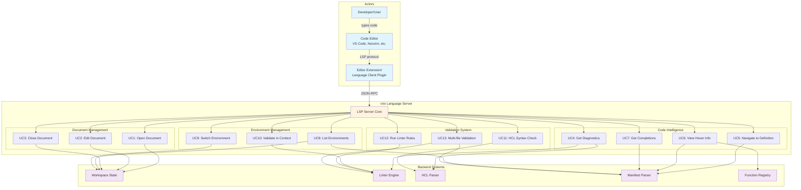

## Detailed Use Cases

### UC1: Open Document (textDocument/didOpen)

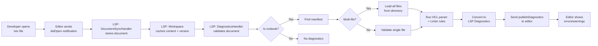

**Actors**: Developer, Editor, LSP Server
**Preconditions**:
- LSP server initialized
- File is `.tx` or `.yml` format
**Flow**:
1. Developer opens file in editor
2. Editor sends `textDocument/didOpen` notification
3. DocumentSyncHandler stores document in workspace state
4. DiagnosticsHandler validates the document
5. Results sent back as diagnostics
**Postconditions**: Document tracked, diagnostics displayed

---

### UC2: Edit Document (textDocument/didChange)

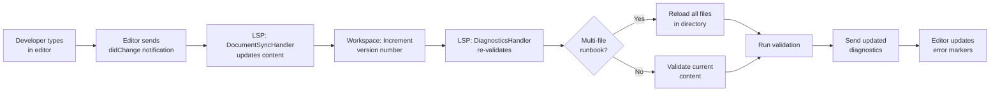

**Actors**: Developer, Editor
**Preconditions**: Document is open
**Flow**:
1. Developer makes changes
2. Editor sends full content in `didChange`
3. DocumentSyncHandler updates workspace
4. Automatic re-validation triggered
5. Fresh diagnostics sent
**Postconditions**: Document state synchronized, validation current

---

### UC4: Get Diagnostics (Validation)

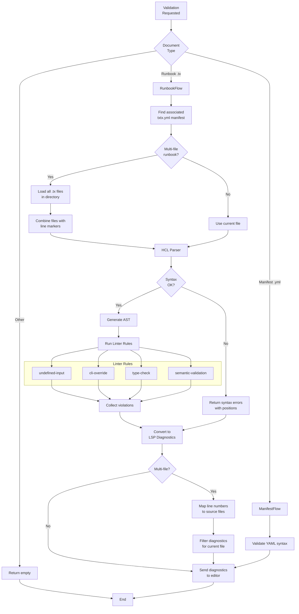

**Actors**: LSP Server, Linter, HCL Parser
**Purpose**: Provide real-time validation feedback
**Features**:
- Syntax validation (HCL parser errors)
- Semantic validation (linter rules)
- Environment-aware checking
- Multi-file runbook support

---

### UC5: Navigate to Definition (textDocument/definition)

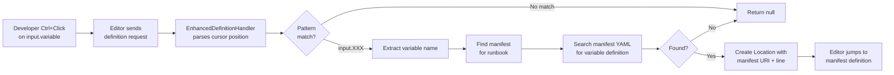

**Actors**: Developer, Editor
**Trigger**: Developer invokes "Go to Definition" on `input.variable`
**Flow**:
1. Editor sends cursor position
2. Handler extracts `input.` reference
3. Searches manifest environments
4. Returns location or null
**Result**: Editor navigates to variable definition in manifest

---

### UC6: View Hover Information (textDocument/hover)

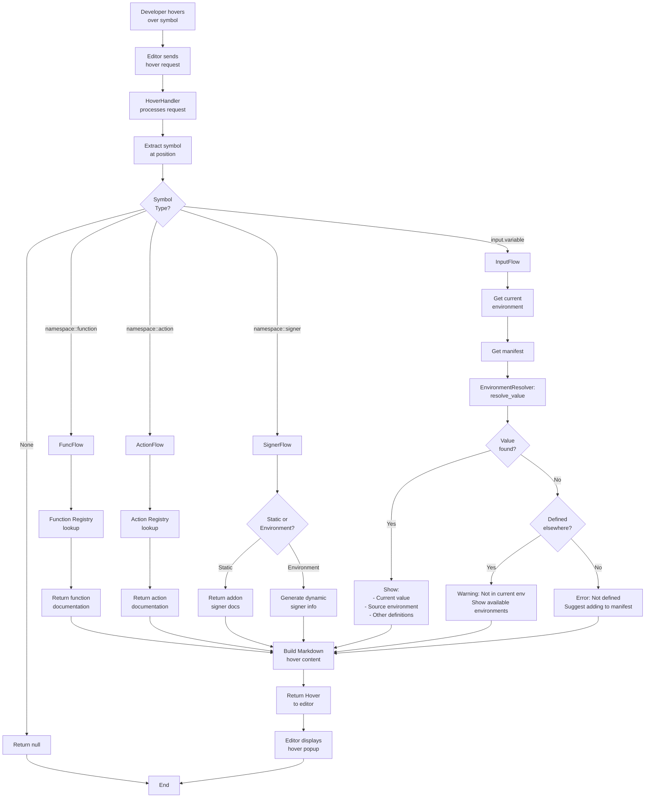

**Actors**: Developer, Editor, LSP Server
**Types of Hover Info**:

1. **Functions** (`std::encode_hex`): Shows function signature and documentation
2. **Actions** (`evm::deploy_contract`): Shows action parameters and description
3. **Signers** (`bitcoin::alice`): Shows signer type and environment info
4. **Inputs** (`input.api_key`):
   - Shows current value in active environment
   - Warns if not defined in current environment
   - Lists other environments where defined
5. **Debug Commands** (`input.dump_txtx_state`): Special diagnostic info

---

### UC7: Get Completions (textDocument/completion)

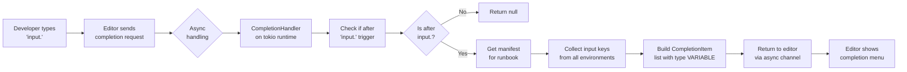

**Actors**: Developer, Editor
**Trigger**: User types `input.` or invokes completion
**Features**:
- Trigger character: `.`
- Runs asynchronously (non-blocking)
- Shows all available inputs across environments
**Result**: Dropdown list of available input variables

---

### UC8: List Environments (workspace/environments)

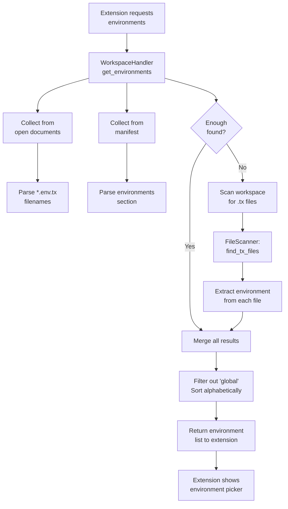

**Actors**: Editor Extension, LSP Server
**Purpose**: Populate environment selector UI
**Sources**:
1. Open document filenames (*.{env}.tx)
2. Manifest environments section
3. Workspace file scan (if needed)
**Result**: List like `["sepolia", "mainnet", "testnet"]`

---

### UC9: Switch Environment (workspace/setEnvironment)

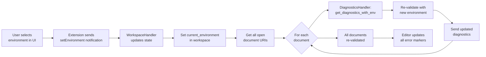

**Actors**: Developer, Extension, LSP Server
**Flow**:
1. User selects environment from dropdown
2. Extension sends custom notification
3. Server updates global environment state
4. **All open documents re-validated** in new context
5. Fresh diagnostics sent for each document
**Impact**: Validation now checks against selected environment's inputs

---

### UC10: Validate in Context (Environment-Aware)

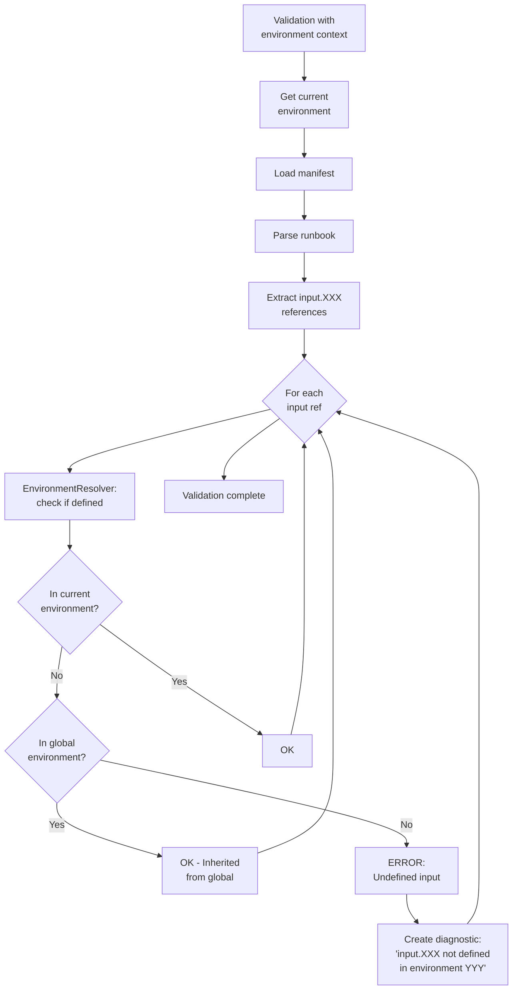

**Purpose**: Ensure runbooks are valid for selected environment
**Key Rule**: `undefined-input` linter rule
**Behavior**:
- Checks each `input.` reference
- Resolves against current environment + global fallback
- Warns if input missing in selected environment
**Example**:
- Environment: `sepolia`
- Code: `api_key = input.mainnet_rpc`
- Result: Error if `mainnet_rpc` not in sepolia or global

---

### UC11: HCL Syntax Check

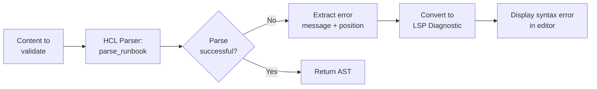

**Purpose**: Catch HCL syntax errors immediately
**Examples**:
- Missing closing braces
- Invalid attribute syntax
- Malformed strings
**Position Extraction**: Regex parsing of HCL error messages

---

### UC12: Run Linter Rules

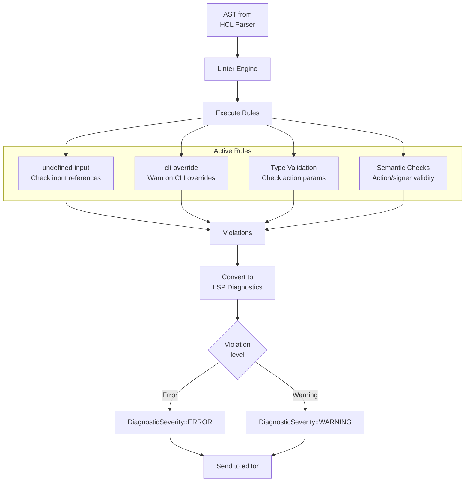

**Linter Rules**:
1. **undefined-input**: Checks input references against manifest + environment
2. **cli-override**: Warns when CLI inputs override environment values
3. **type-validation**: Validates action parameters match schemas
4. **semantic-validation**: Checks action types, signer references, etc.

**Integration**: `LinterValidationAdapter` bridges linter to LSP diagnostics

---

### UC13: Multi-file Validation

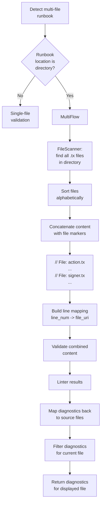

**Purpose**: Support directory-based runbooks
**Example Structure**:
```
runbooks/
  my_runbook/
    actions.tx
    signers.sepolia.tx
    inputs.tx
```

**Process**:
1. Detect directory-based runbook in manifest
2. Load all `.tx` files in directory
3. Combine with file markers for position tracking
4. Validate as single unit
5. Map diagnostics back to original files
6. Return only diagnostics for current file

**Benefits**:
- Cross-file reference validation
- Consistent action/signer resolution
- Cleaner project organization

---

## Actor Descriptions

### Primary Actors

**Developer/User**
- Writes txtx runbooks
- Interacts through code editor
- Benefits from IDE features

**Code Editor** (VS Code, Neovim, etc.)
- Implements LSP client
- Displays diagnostics and UI
- Sends LSP requests

**Editor Extension/Plugin**
- Language-specific integration
- Custom UI (environment picker)
- Translates custom requests

### System Components

**LSP Server Core**
- Request router
- Handler orchestration
- Async task management

**Workspace State**
- Document cache
- Manifest cache
- Environment state

**Linter Engine**
- Rule execution
- Violation reporting
- Configurable rules

**HCL Parser**
- Syntax validation
- AST generation
- Error reporting

**Function Registry**
- Static function/action metadata
- Documentation lookup
- Signer type info

## Environment Context Flow

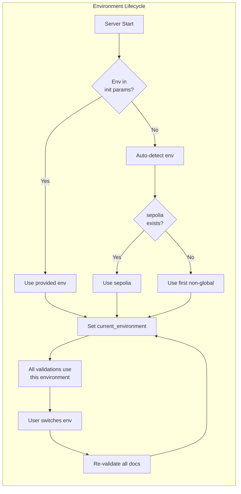

## Summary of Use Cases

| Use Case | Actor | Trigger | Result |
|----------|-------|---------|--------|
| UC1: Open Document | Developer | Opens file | Document tracked + validated |
| UC2: Edit Document | Developer | Types in editor | Content synchronized + re-validated |
| UC3: Close Document | Developer | Closes file | Document removed from cache |
| UC4: Get Diagnostics | LSP Server | Document change | Errors/warnings displayed |
| UC5: Navigate to Definition | Developer | Ctrl+Click | Jump to manifest variable |
| UC6: View Hover Info | Developer | Hover over symbol | Popup with documentation/value |
| UC7: Get Completions | Developer | Types `input.` | Dropdown of available inputs |
| UC8: List Environments | Extension | Load workspace | Environment picker populated |
| UC9: Switch Environment | Developer | Selects from UI | All docs re-validated in context |
| UC10: Validate in Context | LSP Server | Environment set | Environment-aware checks |
| UC11: HCL Syntax Check | LSP Server | Parse document | Syntax error reporting |
| UC12: Run Linter Rules | LSP Server | Validate | Semantic error/warning reporting |
| UC13: Multi-file Validation | LSP Server | Directory runbook | Cross-file validation |

## Integration Points

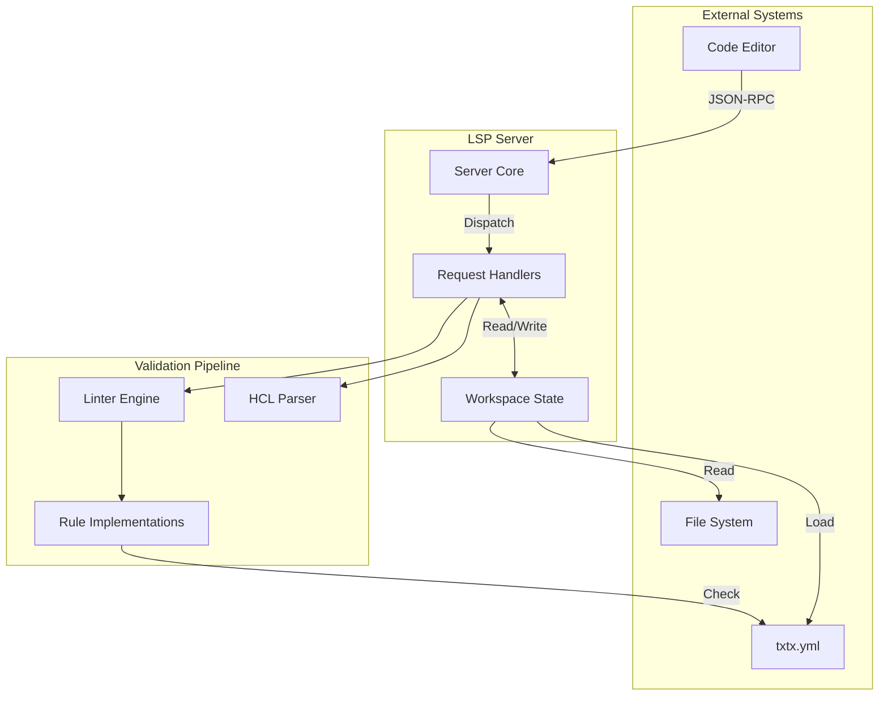
