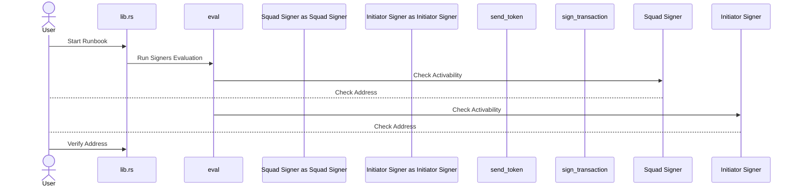
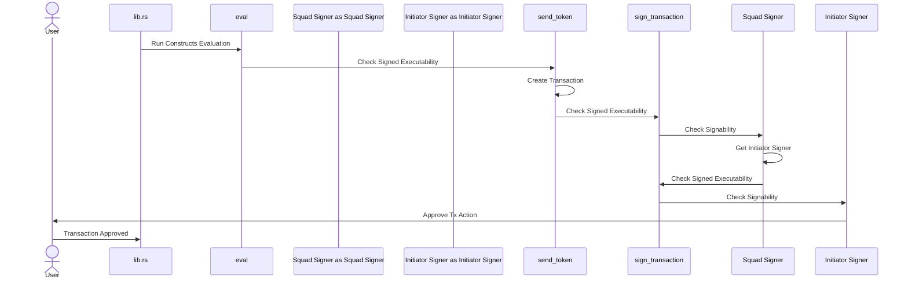

Starting a runbook through Verifying Addresses


Verified address through Activated signers:
```
sequenceDiagram
  actor User as User
  participant lib.rs as lib.rs
  participant eval as eval
  participant Squad Signer as Squad Signer
  participant Initiator Signer as Initiator Signer
  participant Squad Signer as Squad Signer
  participant send_token as send_token
  participant sign_transaction as sign_transaction
      
lib.rs ->> eval: Run Signers Evaluation
eval ->> Squad Signer: Activate
Squad Signer ->> Squad Signer: Compute Keys
Squad Signer ->> Initiator Signer: Activate
Initiator Signer ->> Squad Signer: Return Keys
Squad Signer ->> eval: Return Keys
eval ->> lib.rs: Signers Activated
```

Activated signers through approved proposal tx


Transaction approved through signed proposal
```mermaid
lib.rs ->> eval: Run Constructs Evaluation
eval ->> send_token: Check Signed Executability
send_token ->> Squad Signer: Check Signability
Squad Signer ->> send_token: No Action
send_token ->> eval: No Action
eval ->> send_token: Run Signed Execution
send_token ->> sign_transaction: Run Signed Execution
sign_transaction ->> Squad Signer: Sign
Squad Signer ->> Squad Signer: Wrap Tx in Proposal

